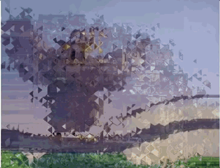

# MTTransitions

Transitions ports from [GL-Transitions](https://gl-transitions.com/)




## Features

- [x] Up to 76 transitions
- [x] Image Transitions
- [x] UIView Transitions
- [x] UIViewController Push Transtions
- [x] UIViewController Present Transitions
- [x] Video Merge Transitions

## Requirements

* iOS 9.0 +
* Xcode 11.0 +
* Swift 5.0 +

## Transitions

Support Following Transitions:

- [x] MTAngularTransition
- [x] MTBounceTransition
- [x] MTBowTieHorizontalTransition
- [x] MTBowTieVerticalTransition
- [x] MTBurnTransition
- [x] MTButterflyWaveScrawlerTransition
- [x] MTCannabisleafTransition
- [x] MTCircleCropTransition
- [x] MTCircleTransition
- [x] MTCircleOpenTransition
- [x] MTColorPhaseTransition
- [x] MTColourDistanceTransition
- [x] MTCrazyParametricFunTransition
- [x] MTCrossZoomTransition
- [x] MTCrossHatchTransition
- [x] MTCrossWarpTransition
- [x] MTCubeTransition
- [x] MTDirectionalTransition
- [x] MTDirectionalWarpTransition
- [x] MTDirectionalWipeTransition
- [x] MTDisplacementTransition
- [x] MTDoomScreenTransition
- [x] MTDoorwayTransition
- [x] MTDreamyTransition
- [x] MTDreamyZoomTransition
- [x] MTFadeTransition
- [x] MTFadeColorTransition
- [x] MTFadegrayscaleTransition
- [x] MTFlyeyeTransition
- [x] MTGlitchDisplaceTransition
- [x] MTGlitchMemoriesTransition
- [x] MTGridFlipTransition
- [x] MTHeartTransition
- [x] MTHexagonalizeTransition
- [x] MTInvertedPageCurlTransition
- [x] MTKaleidoScopeTransition
- [x] MTLinearBlurTransition
- [x] MTLumaTransition
- [x] MTLuminanceMeltTransition
- [x] MTMorphTransition
- [x] MTMosaicTransition
- [x] MTMultiplyBlendTransition
- [x] MTPerlinTransition
- [x] MTPinwheelTransition
- [x] MTPixelizeTransition
- [x] MTPolarFunctionTransition
- [x] MTPolkaDotsCurtainTransition
- [x] MTRadialTransition
- [x] MTRandomSquaresTransition
- [x] MTRippleTransition
- [x] MTRotateScaleFadeTransition
- [x] MTSimpleZoomTransition
- [x] MTSquaresWireTransition
- [x] MTSqueezeTransition
- [x] MTStereoViewerTransition
- [x] MTSwapTransition
- [x] MTSwirlTransition
- [x] MTUndulatingBurnOutTransition
- [x] MTWaterDropTransition
- [x] MTWindTransition
- [x] MTWindowBlindsTransition
- [x] MTWindowSliceTransition
- [x] MTWipeDownTransition
- [x] MTWipeLeftTransition
- [x] MTWipeRightTransition
- [x] MTWipeUpTransition
- [x] MTZoomInCirclesTransition

## Installation

MTTransitions is available through CocoaPods. To install it, simply add the following line to your Podfile:

```sh
pod MTTransitions
```

## Get Started

Each transition requires two input `MTIImage`.

```swift
import MTTransitions

let transition = MTBounceTransition()
transition.inputImage = <from Image>
transition.destImage = <to Image>

// animate progress from 0.0 to 1.0

imageView.image = transition.outputImage

```

### UIView Transition

```swift
let effect = MTPerlinTransition()

MTTransition.transition(with: view, effect: effect, animations: {
    // Do your animation to your view
}) { (_) in
    // Transition completed
}
```

### UIViewController Push Transition

```swift

class PushAViewController: UIViewController {

    private let transition = MTViewControllerTransition(transition: MTBurnTransition())
    
    // ...
}

extension PushAViewController: UINavigationControllerDelegate {
    
    func navigationController(_ navigationController: UINavigationController, animationControllerFor operation: UINavigationController.Operation, from fromVC: UIViewController, to toVC: UIViewController) -> UIViewControllerAnimatedTransitioning? {
        if operation == .push {
            return transition
        }
        return nil
    }
}
```

### UIViewController Present Transition

```swift

class PresentAViewController: UIViewController {

    // ...
    
    let vc = PresentBViewController()
    vc.modalPresentationStyle = .fullScreen
    vc.transitioningDelegate = self
    present(vc, animated: true, completion: nil)
}

extension PresentAViewController: UIViewControllerTransitioningDelegate {
    
    func animationController(forDismissed dismissed: UIViewController) -> UIViewControllerAnimatedTransitioning? {
        return transtion
    }
    
    func animationController(forPresented presented: UIViewController, presenting: UIViewController, source: UIViewController) -> UIViewControllerAnimatedTransitioning? {
        return transtion
    }
}
```

### Video Transition

limitations

* Two videos must have the same resolution size
* Two videos must contains video track and audio track
* Two videos must large than 5 seconds


```
let effect = MTTransition.Effect.wipeLeft
let duration = CMTimeMakeWithSeconds(2.0, preferredTimescale: 1000)
let videoTransition = MTVideoTransition() 
videoTransition.transitionDuration = duration
videoTransition.makeTransition(with: clips, effect: effect) { result in
    // handle the result
}
```
